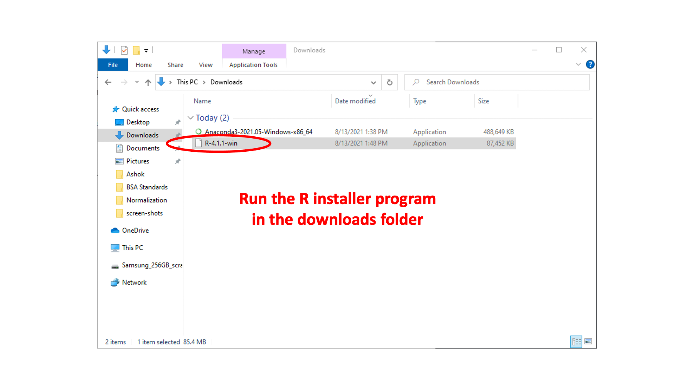
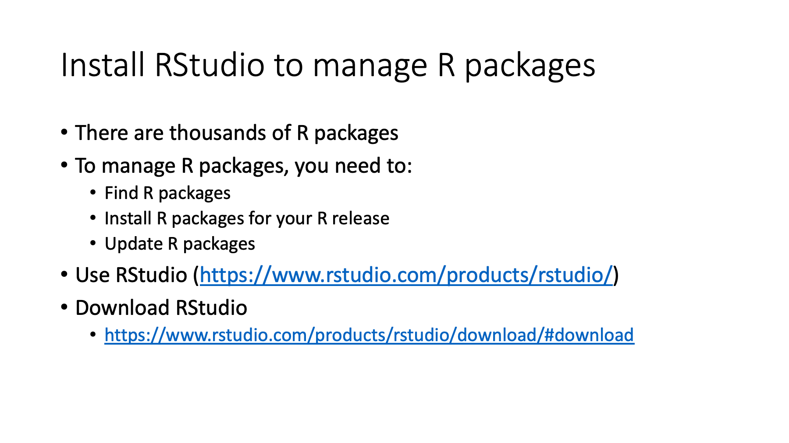
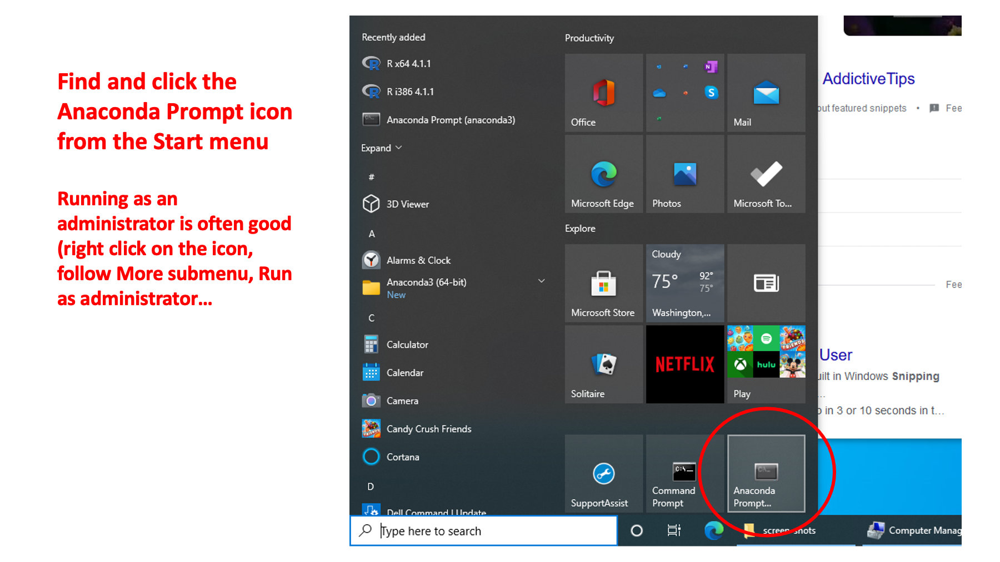

# R-Jupyter-notebook-setup

## Phil Wilmarth   PSR Core, OHSU   August 29, 2021

---

A walk through of my preferred way to add an R kernel to Jupyter notebooks for proteomics data analysis work. There are many different ways to do this. Most are geared towards folks who live in programming development environments. What I am outlining is more for the folks who spend more time generating data than analyzing data.

---

Slide 1

---

Slide 2

---

Slide 3

---

Slide 4

---

Slide 5

---

Slide 6

---

Slide 7

---

Slide 8

---

Slide 9

---

Slide 10

---

Slide 11

---

Slide 12

---

Slide 13

---

Slide 14

---

Slide 15

---

Slide 16

---

Slide 17

---

Slide 18

---

Slide 19

---

Slide 20

---

Slide 21

---

Slide 22

---

Slide 23

---

Slide 24

---

Slide 25

---

Slide 26

---

Slide 27

---

Slide 28

---

Slide 29

---

Slide 30

---

Slide 31

---

Slide 32

---

Slide 33

---

Slide 34

---

Slide 35

---

Slide 36

---

Slide 37

---

Slide 38

---

-Phil Wilmarth, OHSU  
-August 29, 2021
